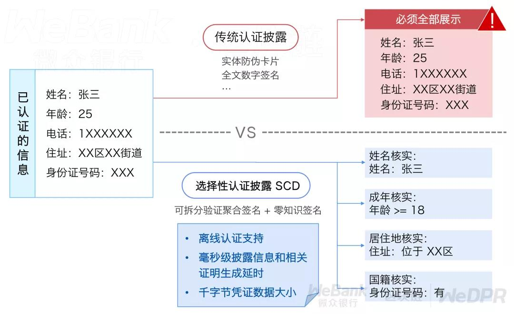

# 选择性认证披露场景方案

## SCD隐私保护解决方案

在信息时代，信息披露无处不在，无论是个人还是企业，在日常活动中，都需要向不同实体披露经过认证的信息。例如，个人每次入住旅店时，需要出示本人身份证；企业每次参与竞标，需要提供经过相关部门认证的资质证明。

在传统方式中，为了获得此类认证后的凭证，用户往往需要向认证部门提供一系列认证材料，并完成相关认证手续，才能获得由相关部门签发的凭证，交互代价很高，往往只能支持捆绑认证，即多项数据只能一同认证且一同披露明文。

回到入住旅店的场景，虽然旅店要求客人出示身份证的主要目的是验证其为合法且满足年龄要求的公民，但这一看似平常的行为，也泄露了客人额外的敏感信息，如家庭住址、身份证号码等。在类似的企业资质证明中，尽管很多时候，仅需要证明企业特定财务情况满足一定的下限，而在传统的信息披露方式中，却不得不要求企业披露完整的敏感财务信息，由此未能实现隐私数据最小化信息披露，带来了不必要的隐私数据泄露风险。



针对这类场景痛点，WeDPR**选择性认证披露解决方案**，提供了最小化认证数据披露效果，**仅需认证一次**，在随后的信息披露过程中，用户可以自主选择需要披露的证书属性值明文，或者使用更为神奇的零知识断言披露方式，仅需提供“自身证书属性值满足认证条件”的断言证明（例如，证明我的年龄大于20岁，但不告诉对方具体几岁），而不提供任何隐私数据明文信息。

在技术层面，选择性认证披露的核心功能包括：用户可以在不依赖可信第三方服务的前提下，支持已认证证书中**任意类型的属性集合**中**任意子集的隐私数据披露**，并支持**基于属性值的零知识断言披露**，从而实现用户在证明自身具备某些属性值同时，完美保护了隐私属性值的明文和其他不必要披露的隐私属性值。

此外，选择性认证披露还进一步支持多个属性值同时进行零知识断言披露，仅当所有属性值都满足条件时，才能验证通过，当任一条件不满足时，不会泄露其他条件的满足情况，真正意义上实现了认证隐私数据的**最小化信息披露**。

SCD场景式解决方案实现了“属性隐私同时可认证可监管”的业务模型，支持二次开发，能快速满足有“隐私认证身份凭证”需求的业务场景，如私密数字凭证、智慧医疗金融等。SCD场景式解决方案目前已经集成到微众银行自主研发并开源的**WeIdentity 分布式数字身份解决方案**中（[WeIdentity github仓库地址](https://github.com/WeBankFinTech/WeIdentity)；[WeIdentity gitee仓库地址](https://gitee.com/WeBank/WeIdentity)）。

## SCD核心算法组件特性

WeDPR-Lab开源社区版中提供了SCD解决方案的核心算法组件和使用示例，具体包括:

- 选择性认证披露的Demo示例

- 选择性披露证书的全流程功能

  - 选择性披露证书的颁发
  - 选择性披露证书的混淆
  - 选择性披露认证的零知识断言证明
  - 选择性披露认证的零知识断言验证
  - 选择性属性明文披露和验证

- 各类数值逻辑关系的零知识断言的证明和验证
  - 相等
  - 大于
  - 小于
  - 大于等于
  - 小于等于

- 其他基础工具代码

## SCD示例快速体验

为了便于用户更易理解选择性认证披露的效果，我们在SCD Demo中设定了如下具体示例应用场景：

用户申请“优秀青年”奖项，该奖项的申请条件为：年龄在[18,40]区间内，且贡献级大于6。根据具体贡献值，奖项又划分为：

- 贡献级 = 10，为 一等奖；
- 贡献级 = 9 ，为 二等奖；
- 贡献级 = 7或8 ，为 三等奖。

奖项授予方通过审核用户提供的个人认证信息，向用户反馈其是否具有该奖项的申请资格及对应的奖项评级。

完成[安装步骤](./installation.md)之后，进入示例目录，运行：

 ```bash
cd WeDPR-Lab-Core/solution/selective_certificate_disclosure
cargo run
 ```

cargo run之后按照Demo指引，设置中文或英文作为演示语言，按步骤输入即可进行体验。

体验流程描述如下：

1. 用户基于属性模板填写个人凭证信息：年龄及贡献级。

2. 用户请求权威机构进行个人凭证信息认证，获得认证后的凭证。

3. 为防止权威机构对认证凭证的使用进行跟踪，用户对认证后的凭证进行混淆，获得混淆凭证。

4. 用户选择个人信息凭证披露方式（分别描述为以下5、6步骤）。

5. 用户仅提供断言证明，证明满足全部申报条件， 但不透露任何字段值。

   - 用户生成并向奖项授予方提交“自身凭证信息满足奖项申请条件”的断言证明。

   *（这种披露方式，奖项授予方无法直接获得用户个人凭证信息的明文，但通过对其断言证明的验证，即可判断该用户是否具有奖项申请资格。）*

6. 用户提供贡献级明文信息及其正确性证明， 但不透露年龄。

   - 用户为其贡献级信息生成正确性证明。
   - 用户生成“自身年龄满足奖项的年龄申请条件"的断言证明。
   - 用户向奖项授予方提交贡献级明文、贡献级正确性证明、年龄断言证明。

   *（这种披露方式，奖项授予方直接获得用户个人凭证信息中的贡献级明文，从而进行奖项等级评定；但无法直接获得用户的年龄信息，只能通过对其年龄断言证明的验证，判断该用户是否满足奖项的年龄申请条件。）*

7. 用户获得奖项授予方验证并返回的奖项资格验证结果。